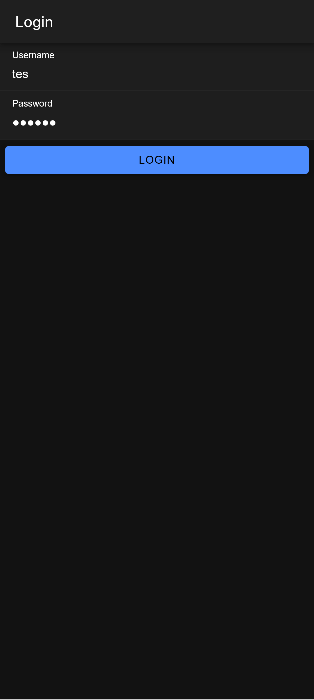
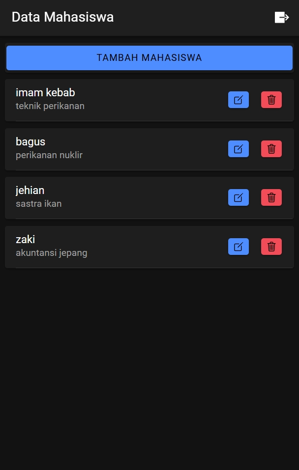
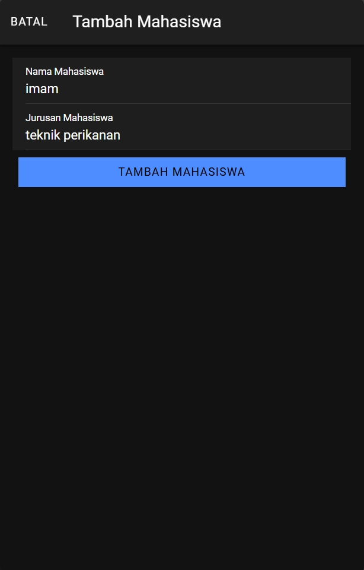
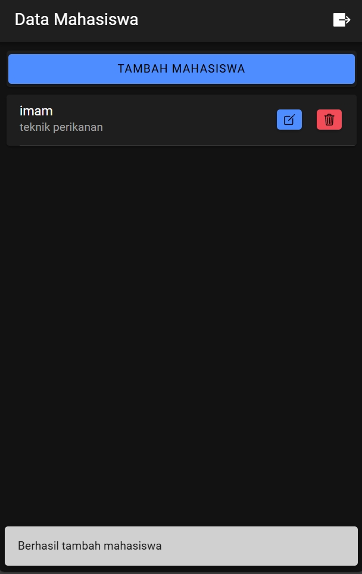
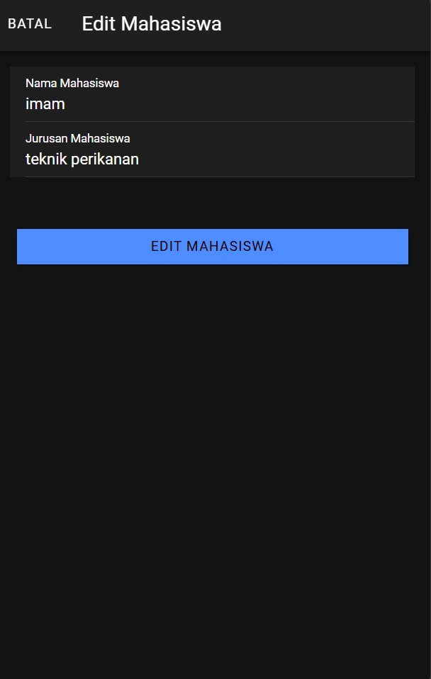
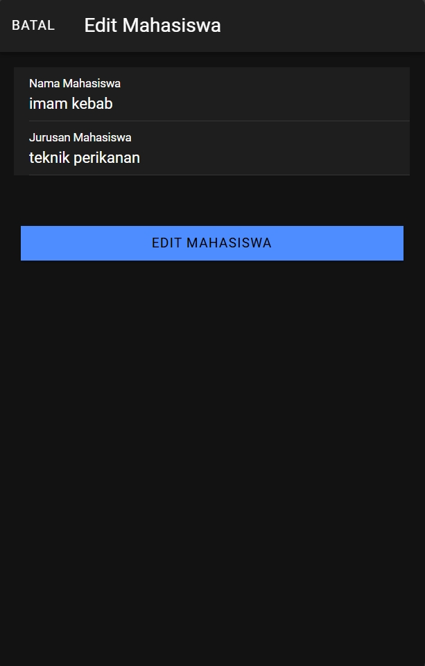
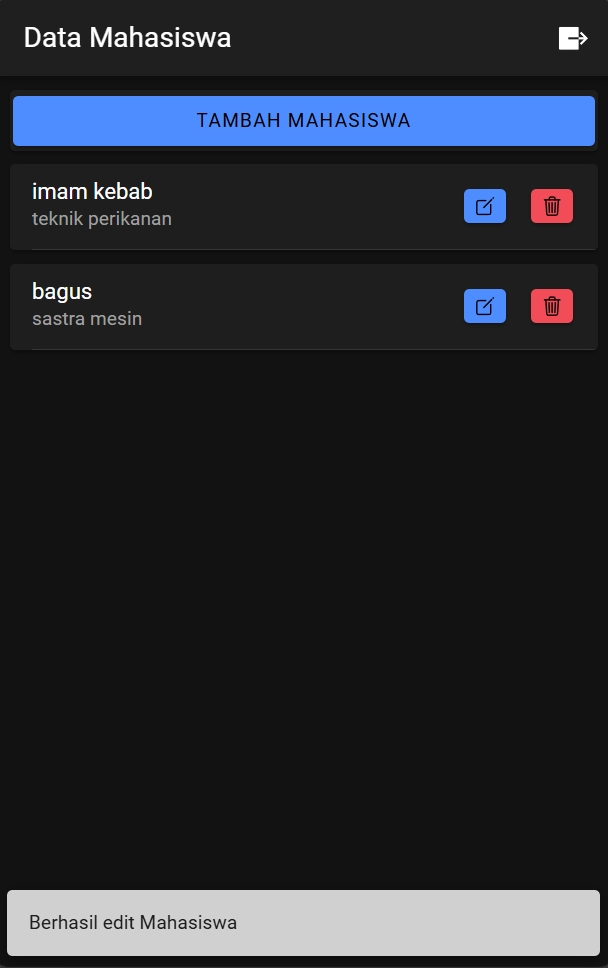
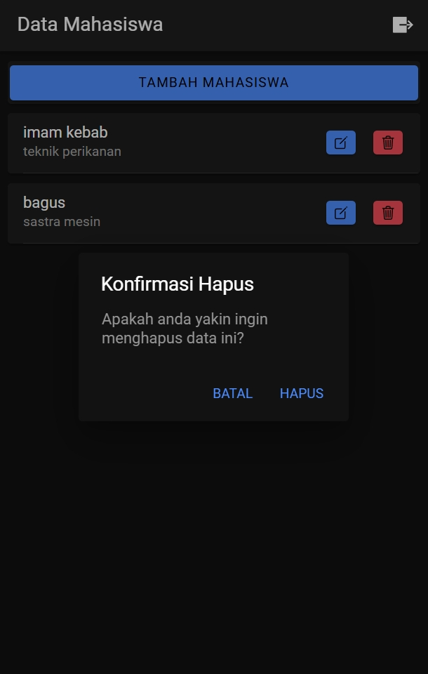
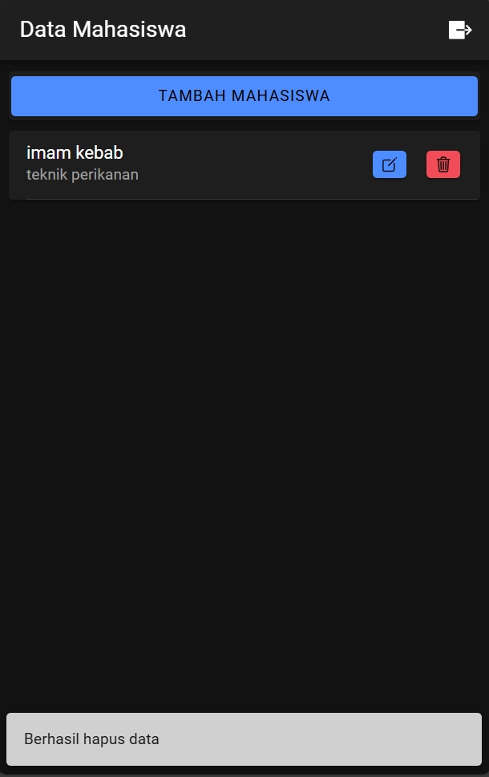

# Tugas 8 - Pertemuan 9

Dibuat oleh:
- Nama: Muhammad Rafi Attariq
- NIM: H1D0220656

## Screenshot & Penjelasan

### 1. Login Page

- Password dihash untuk keamanan
- Menyimpan data user di localStorage setelah login berhasil

### 2. Mahasiswa Page (Read)

- Menampilkan daftar mahasiswa dalam bentuk card
- Setiap card menampilkan nama & jurusan mahasiswa
- Terdapat tombol untuk tambah, edit, dan hapus data
- Tombol logout di pojok kanan atas

### 3. Tambah Data (Create)

 

- Modal untuk menambah data mahasiswa baru
- Notifikasi toast setelah berhasil menambah data

### 4. Edit Data (Update)

  

- Modal untuk mengubah data mahasiswa
- Form auto fill dengan data yang ingin diedit
- Perubahan akan tersimpan setelah klik tombol edit
- Notifikasi toast setelah berhasil mengubah data

### 5. Hapus Data (Delete)

 

- Konfirmasi dialog sebelum hapus data
- Opsi u/ batal atau lanjut hapus
- Notifikasi toast setelah data berhasil dihapus
